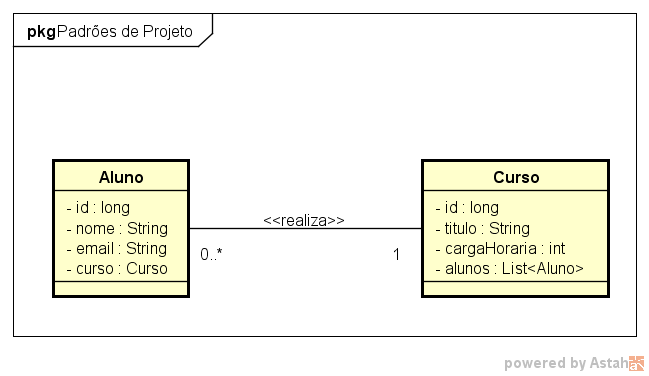
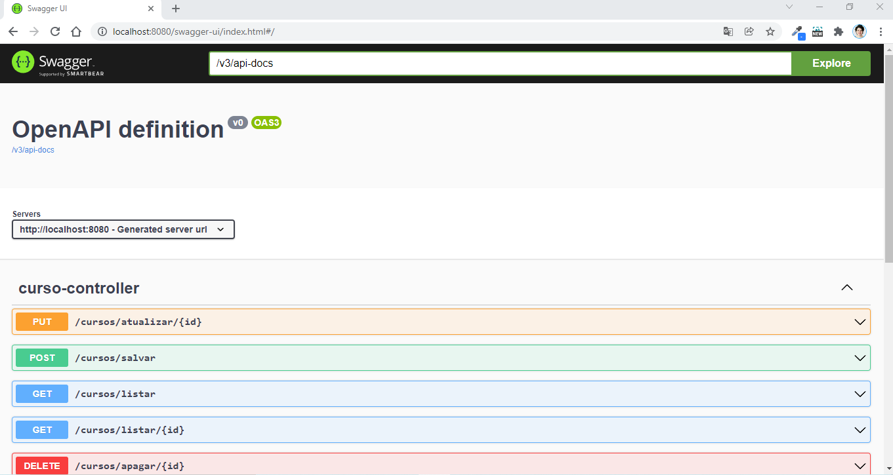

# GFT Start #3 Java
## Padrões de Projeto com Spring em Java
#### Java

#### Programa de Exemplo MVC com Spring desenvolvido através de um modelo UML feito por mim para exemplificar a relação entre modelos de entidade de negócio e gerar um programa de API Rest.

/**/

#### O Programa foi desenvolvido na IDE Eclipse.
[Baixar IDE Eclipse](https://www.eclipse.org/downloads/)

#### Foi adicionado o plugin do Spring Atualizado ao Eclipse.

#### A estrutura foi organizada da seguinte forma:

- Pacote: br.com.kbadigital

1. Pacote 1 : controller
2. Pacote 2 : model
3. Pacote 3 : service

#### Cada pacote contêm classes que possui filalidades distintas.

#### O programa cria uma API Rest que foi implemetada em Spring Boot, e para acessar no Browser basta digitar "http://localhost:8080/swagger-ui/index.html" após a execução do programa no eclipse.

#### O Swagger foi instalado na versão 1.6.4
Migrating from SpringFox [Leia mais](https://springdoc.org/#migrating-from-springfox)

/**/

